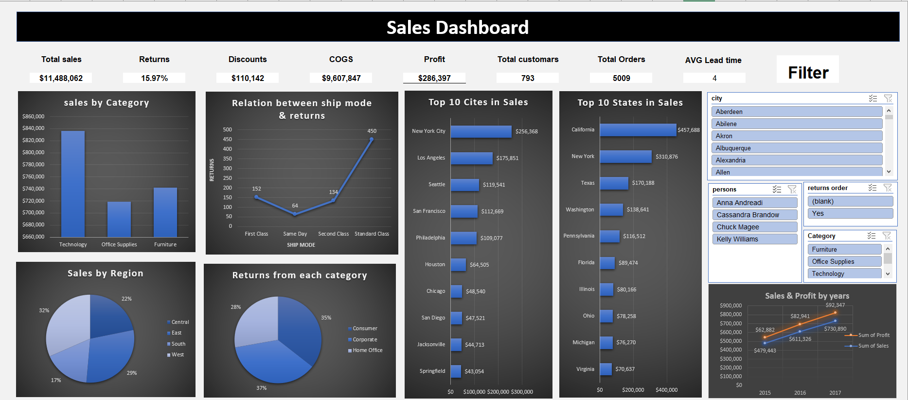

# excel-data-analysis
data analysis project using excel with insights report
# 📊 Sales Data Analysis Dashboard

## 🔹 Overview
This project presents a *Sales Analysis Dashboard* created in Excel.  
The dashboard provides key insights into sales performance, customer behavior, and product returns.  
It combines Pivot Tables, charts, and interactive filters to help decision-makers track business metrics.  

## 🔹 Dashboard Highlights
- *Total Sales*: $11,488,062  
- *Total Profit*: $286,397  
- *Total Customers*: 793  
- *Total Orders*: 5009  
- *COGS*: $9,607,847  
- *Returns*: 800  
- *Discounts*: $110,142  
- *Average Lead Time*: 4 days  

## 🔹 Key Insights
- *Sales by Category*: Technology leads sales compared to Office Supplies and Furniture.  
- *Returns*: Higher return rates observed in Standard Class shipping.  
- *Top Locations*:  
  - Top Cities: New York City, Los Angeles, Seattle.  
  - Top States: California, New York, Texas.  
- *Regional Distribution*: West region accounts for the largest share of sales.  
- *Customer Segments*: Consumer segment contributes to 53% of returns.  
- *Trend*: Both sales and profit have grown steadily between 2015 and 2017.  

## 🔹 Files Included
- data.xlsx → Contains raw data, pivot tables, and dashboards.  
- report.pdf → Summary of the analysis and findings.  

## 🔹 Preview
Here is a snapshot of the dashboard:  
  

## 🔹 How to Use
1. Download and open data.xlsx in Microsoft Excel (2016 or later recommended).  
2. Explore pivot tables, slicers, and interactive charts.  
3. Review report.pdf for a summarized explanation of findings.  

---
